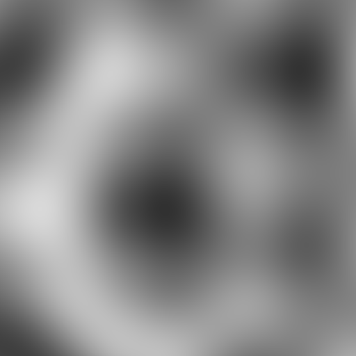

# RPG World Map Generator

This is a simple Go application that uses Perlin noise to generate random world maps suitable for RPGs. It provides a GUI to adjust the map generation parameters and visualize the results in real-time.



## Features

*   Generate random world maps using Perlin noise.
*   Adjust parameters like seed, scale, octaves, persistence, lacunarity, and more.
*   GUI for real-time visualization of the generated map.
*   Save the generated map as a PNG image.
*   Points of Interest (POI) generation using Poisson disk sampling.

## Getting Started

### Prerequisites

*   Go 1.16 or higher
*   Fyne library and its dependencies

### Installation

1.  Clone the repository:
    ```bash
    git clone https://github.com/your-username/rpg-world-map-generator.git
    ```
2.  Go to the project directory:
    ```bash
    cd rpg-world-map-generator
    ```
3.  Install the dependencies:
    ```bash
    go mod tidy
    ```
4.  Run the application:
    ```bash
    go run main.go
    ```

## Usage

1.  Run the application as described above.
2.  Use the sliders in the GUI to adjust the map generation parameters.
3.  Click the "Randomize Seed & Generate" button to generate a new map with a random seed.
4.  Click the "Save PNG" button to save the current map as a PNG file in the project's root directory.

## Parameters

The following parameters can be adjusted in the GUI to control the world generation:

*   **Seed**: The seed for the random number generator. The same seed will always produce the same map.
*   **Scale**: The zoom level of the noise. Higher values produce more zoomed-in maps, and lower values produce more zoomed-out maps.
*   **Octaves**: The number of layers of noise to combine. More octaves add more detail to the map.
*   **Persistence**: How much each successive octave contributes to the overall shape. Lower values create smoother terrain, while higher values create rougher terrain.
*   **Lacunarity**: The frequency multiplier for each successive octave. Higher values create more fine-grained detail.
*   **Continent Freq**: The frequency of the noise that generates the large-scale continent shapes.
*   **Continent Octaves**: The number of octaves for the continent noise.
*   **Continent Weight**: How much the continent noise contributes to the final map shape.
*   **Falloff**: Controls how quickly the land drops off into the sea around the edges of the map.
*   **Falloff Weight**: How much the falloff effect contributes to the final map shape.
*   **Sea Level**: The height at which the water level is set.
*   **Min. Distance**: The minimum distance between points of interest (POIs).
*   **Flow Scale**: The scale of the noise used to create the flow map, which distorts the terrain to create more natural-looking features.
*   **Flow Strength**: The strength of the flow map distortion.

## Contributing

Pull requests are welcome. For major changes, please open an issue first to discuss what you would like to change.
